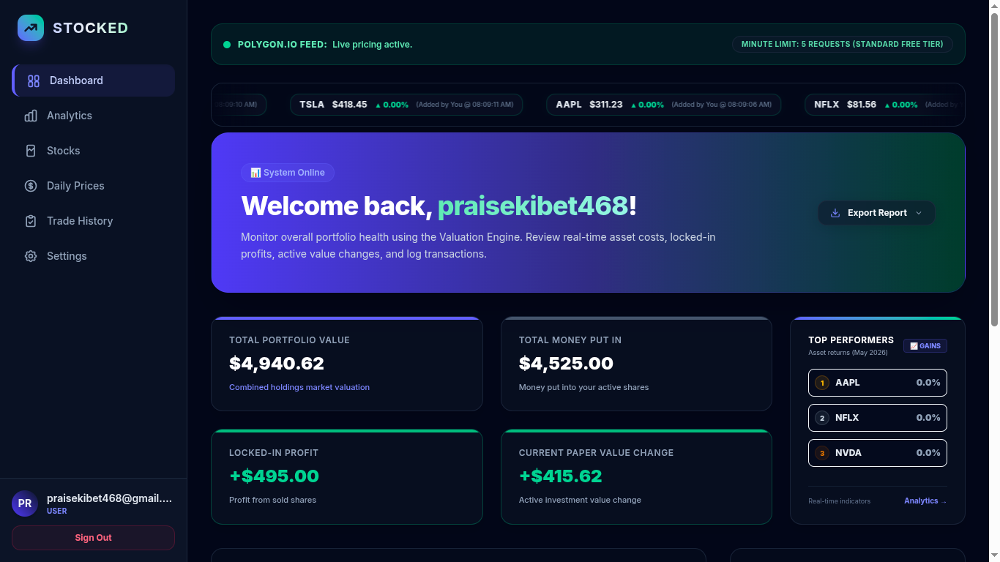
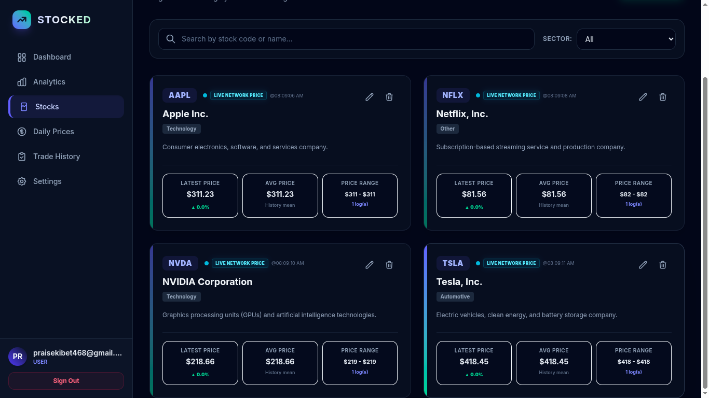
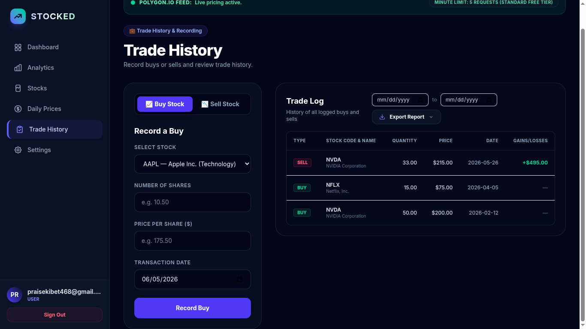
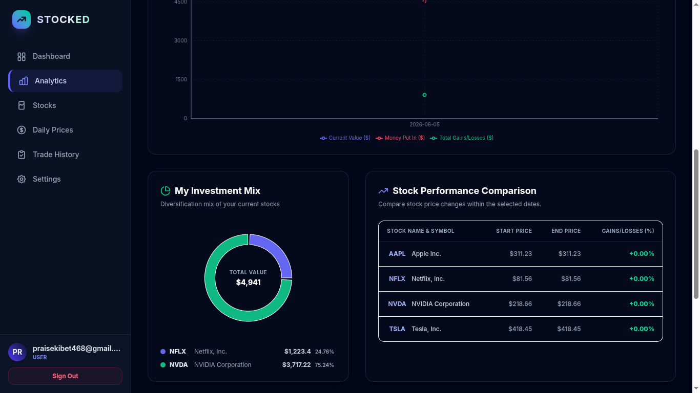
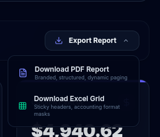
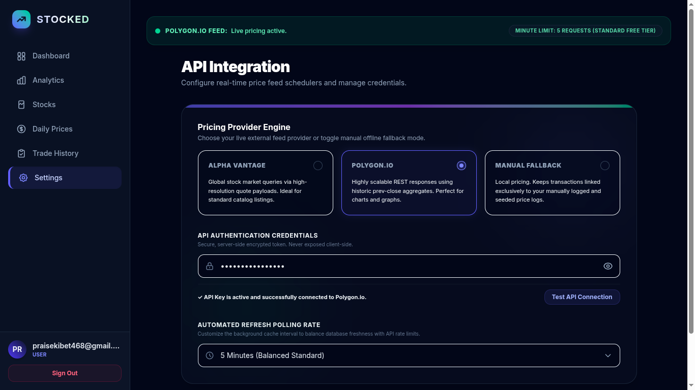

# 📈 Stocked — Capital Market Portfolio Tracker

Stocked is a simulation-focused, full-stack capital market portfolio management application. It serves as a structured tool for tracking stock counter registration, recording transactions (purchases/sales), monitoring daily prices, calculating cost-basis analytics, and exporting professional financial reports.

The application features a modern, responsive design built with **Next.js (App Router)** and **Tailwind CSS** on the frontend, and a modular **Node.js/Express + Sequelize** REST API on the backend.

---

## 📸 Application Showcase

> [!TIP]
> Save your application screenshots to the [screenshots](file:///home/codespartan/Projects/Stocked/screenshots/) directory using the designated filenames (e.g., `dashboard.png`) to have them render in the grid below.

| 🖥️ Dashboard Overview | 📁 Stocks Management |
| :---: | :---: |
|  <br> *Portfolio summary cards, unrealized/realized P&L, recent transaction ledger* |  <br> *Register, search, and edit stock counters with unique symbols* |

| 💸 Transaction Recording | 📊 Interactive Analytics |
| :---: | :---: |
|  <br> *Purchase and sale entries with built-in validation to prevent short-selling* |  <br> *Interactive Recharts for price trends, trading volumes, and portfolio returns* |

| 📄 Report Exports | ⚙️ Config & Settings |
| :---: | :---: |
|  <br> *Generate branded PDF summaries and download transaction ledger Excel files* |  <br> *Configure third-party real-time market price-feed integrations and intervals* |

---

## 🚀 Key Features

- **Multi-Tenant User Isolation**: Secure authentication powered by Firebase Authentication (or custom JWT sessions). Data is strictly scoped to each user (`userId`).
- **Comprehensive Portfolio Tracking**: 
  - Computes total shares held, total invested capital, and total portfolio valuation.
  - Automatically calculates **Realized Profit & Loss (P&L)** at the moment of sale.
  - Dynamically calculates **Unrealized P&L** based on current stock prices versus **Average Purchase Cost basis**.
  - Prevents short-selling: entries are blocked if the user tries to sell more than they hold.
- **Daily Price Management**: Supports historical price & volume logs, manual entries, and automated real-time price-feed sync.
- **Dynamic Visualizations**: Recharts-powered graphs for individual stock trends and overall portfolio growth over time.
- **Reporting System**: Export portfolio sheets directly to Excel (`.xlsx`) or custom-branded PDFs.
- **Real-Time Integration**: Support for external API market price feeds (e.g., Alpha Vantage or Polygon.io) with custom caching and manual fallback.

---

## 🛠️ Tech Stack

### Frontend
- **Framework**: [Next.js](https://nextjs.org/) (App Router, TypeScript)
- **Styling**: [Tailwind CSS v4](https://tailwindcss.com/)
- **Charts**: [Recharts](https://recharts.org/)
- **Icons**: [Lucide React](https://lucide.dev/)

### Backend
- **Framework**: [Express.js](https://expressjs.com/) (Node.js, TypeScript)
- **Database**: [Sequelize ORM](https://sequelize.org/) (SQLite for local dev, Postgres/Neon for production)
- **Reporting**: ExcelJS & PDFKit
- **Auth**: JWT (JSON Web Tokens) & Bcrypt

---

## 📂 Project Structure

```
Stocked/
├── screenshots/        # Application screenshots for the README.md
├── backend/            # Express.js REST API server
│   ├── src/
│   │   ├── config/     # Database and app configurations
│   │   ├── models/     # Sequelize models (User, Stock, DailyPrice, Purchase, Sales, etc.)
│   │   ├── routes/     # API routes and controllers
│   │   ├── services/   # Business logic, P&L calculations, export services
│   │   ├── utils/      # Encryption, validations, helpers
│   │   └── index.ts    # Server entry point
│   ├── database.sqlite # Local development database (auto-generated)
│   └── tsconfig.json
│
├── frontend/           # Next.js UI application
│   ├── src/
│   │   ├── app/        # App router page folders & layouts
│   │   ├── components/ # Reusable UI components (charts, forms, layouts)
│   │   └── lib/        # API client, context providers, fetch utilities
│   ├── public/         # Static assets
│   └── tsconfig.json
│
├── Stocked_SRS.pdf     # Software Requirements Specification (PDF)
└── srs.txt             # Software Requirements Specification (Text format)
```

---

## ⚙️ Setup & Installation

### Prerequisites
Make sure you have [Node.js (v18+)](https://nodejs.org/) and `npm` installed.

---

### 1. Backend Setup

1. Navigate to the backend directory:
   ```bash
   cd backend
   ```
2. Install the backend dependencies:
   ```bash
   npm install
   ```
3. Create your environment variable file by copying `.env.example`:
   ```bash
   cp .env.example .env
   ```
4. Open the `.env` file and configure:
   - **`PORT`**: Port number for backend server (defaults to `5001`).
   - **`JWT_SECRET`**: Secure string for signing JWT tokens.
   - **`ENCRYPTION_SECRET`**: Secure 32-character hex string for sensitive data.
   - **`DATABASE_URL`**: Leave empty to use local **SQLite** (or add your Neon Postgres URL for production).
   - **`PRICE_FEED_PROVIDER`**: Set to `manual` or configure live providers.

5. Start the backend development server:
   ```bash
   npm run dev
   ```
   The API server will run at `http://localhost:5001`.

---

### 2. Frontend Setup

1. Navigate to the frontend directory:
   ```bash
   cd ../frontend
   ```
2. Install the frontend dependencies:
   ```bash
   npm install
   ```
3. Create your environment configuration file:
   ```bash
   cp .env.local.example .env.local
   ```
   *(Ensure `NEXT_PUBLIC_API_BASE_URL` points to `http://localhost:5001`)*

4. Start the frontend Next.js development server:
   ```bash
   npm run dev
   ```
5. Open your browser and navigate to `http://localhost:3000`.

---

## 📈 Accounting & Validation Rules

- **Valuation**: Current portfolio values and unrealized P&L calculations are computed using the **Average Purchase Cost** method:
  $$\text{Average Cost} = \frac{\text{Total Invested Capital}}{\text{Total Shares Purchased}}$$
- **Short-Sell Prevention**: The sales transaction form checks the user's available holdings. Any attempt to record a sale with quantity $Q_{\text{sale}} > Q_{\text{available}}$ will be rejected with a user-friendly error.
- **Realized Profit and Loss**: Determined at the moment of sale and stored in the database:
  $$\text{Realized Profit and Loss} = (\text{Selling Price} - \text{Average Cost at sale time}) \times Q_{\text{sale}}$$

---

## 📄 License & Classification

This repository is classified as **Internal / Educational**. It is developed for educational and personal portfolio simulation purposes and is not intended for regulated financial advice.
