# <p align="center">📈 STOCKED</p>
<h3 align="center">Capital Market Portfolio Management & Simulation Engine</h3>

<p align="center">
  A simulation-grade, full-stack capital market investment platform engineered for tracking equities, logging transactions, automating multi-tier price feeds with circuit breakers, calculating cost-basis analytics (Average Cost & FIFO), managing multi-currency holdings (USD & KES), and generating executive-grade PDF & Excel reports.
</p>

<p align="center">
  
  
  
  
  
  
  
</p>

---

## 📑 Table of Contents

1. [🌟 System Overview & Visual Experience](#-system-overview--visual-experience)
   - [Dual-Theme Presentation: Dark Mode vs. Light Mode](#dual-theme-presentation-dark-mode-vs-light-mode)
2. [🏛️ Core System Architecture](#️-core-system-architecture)
   - [High-Level Component Architecture](#high-level-component-architecture)
   - [Real-Time Data Flow & Failover Pipeline](#real-time-data-flow--failover-pipeline)
3. [✨ Comprehensive Feature Presentation Showcase](#-comprehensive-feature-presentation-showcase)
   - [1. Executive Portfolio Dashboard & Live Ticker](#1-executive-portfolio-dashboard--live-ticker)
   - [2. Advanced Performance Analytics & Intelligent Provider Failover](#2-advanced-performance-analytics--intelligent-provider-failover)
   - [3. Registered Stocks Catalog & Sector Filtering](#3-registered-stocks-catalog--sector-filtering)
   - [4. Daily Price Recording & Historical Market Data Ledger](#4-daily-price-recording--historical-market-data-ledger)
   - [5. Trade Execution & Multi-Currency Transaction Ledger](#5-trade-execution--multi-currency-transaction-ledger)
   - [6. Executive Report Generation (Branded PDF & Formatted Excel)](#6-executive-report-generation-branded-pdf--formatted-excel)
   - [7. System Settings & Platform Administration](#7-system-settings--platform-administration)
     - [A. Appearance & Dynamic Theme Configuration](#a-appearance--dynamic-theme-configuration)
     - [B. Multi-Tier Live Market Price Feeds & Nairobi Securities Exchange (NSE) Scraper](#b-multi-tier-live-market-price-feeds--nairobi-securities-exchange-nse-scraper)
     - [C. Multi-Currency Management & Real-Time FX Conversion Engine](#c-multi-currency-management--real-time-fx-conversion-engine)
     - [D. Cost-Basis Accounting Methodology & Automated Historical Recalculation](#d-cost-basis-accounting-methodology--automated-historical-recalculation)
4. [🧮 Financial Accounting Engine & Mathematical Formulations](#-financial-accounting-engine--mathematical-formulations)
   - [Average Cost Basis (Volume-Weighted Average Price - VWAP)](#average-cost-basis-volume-weighted-average-price---vwap)
   - [First-In, First-Out (FIFO) Lot Allocation](#first-in-first-out-fifo-lot-allocation)
   - [Realized & Unrealized Profit & Loss](#realized--unrealized-profit--loss)
   - [Compound Annual Growth Rate (CAGR) & Annualized Volatility](#compound-annual-growth-rate-cagr--annualized-volatility)
   - [Multi-Currency FX Valuation Normalization](#multi-currency-fx-valuation-normalization)
5. [🔒 Security, Multi-Tenancy & Database Safety Standards](#-security-multi-tenancy--database-safety-standards)
   - [Multi-Tenant User Data Isolation](#multi-tenant-user-data-isolation)
   - [Authenticated API Key Encryption (AES-256-GCM)](#authenticated-api-key-encryption-aes-256-gcm)
   - [Mandatory Database Backup Policy (Per AGENTS.md)](#mandatory-database-backup-policy-per-agentsmd)
6. [🔌 Complete REST API Endpoint Reference](#-complete-rest-api-endpoint-reference)
7. [🚀 Installation, Configuration & Getting Started](#-installation-configuration--getting-started)
   - [Prerequisites](#prerequisites)
   - [Backend Installation & Configuration](#1-backend-installation--configuration)
   - [Frontend Installation & Configuration](#2-frontend-installation--configuration)
   - [Executing Test Suites & Verification](#3-executing-test-suites--verification)
   - [Executing Database Backups](#4-executing-database-backups)
8. [📄 Classification & License](#-classification--license)

---

## 🌟 System Overview & Visual Experience

**Stocked** is an institutional-grade investment management and simulation platform designed to simulate modern capital market operations. Built with an asynchronous, multi-tenant Express REST backend and a responsive Next.js 15 (App Router) frontend, Stocked delivers end-to-end portfolio tracking, multi-tier live market price feeds with automated circuit-breaker failover, robust transaction accounting, and dynamic financial reporting.

### Dual-Theme Presentation: Dark Mode vs. Light Mode

Stocked is engineered with a bespoke, accessible dual-theme design system. Users can switch between dark, light, or OS-synchronized themes with instantaneous zero-page-reload rendering powered by React Context, local persistence, and native CSS custom properties.

| 🌙 Dark Mode Presentation | ☀️ Light Mode Presentation |
| :---: | :---: |
| 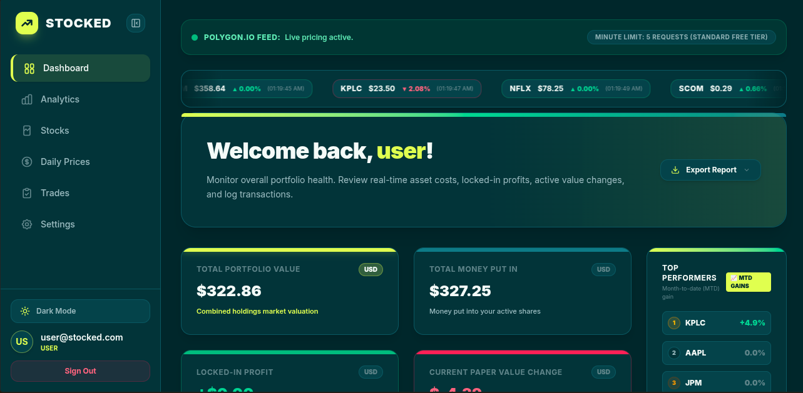 | 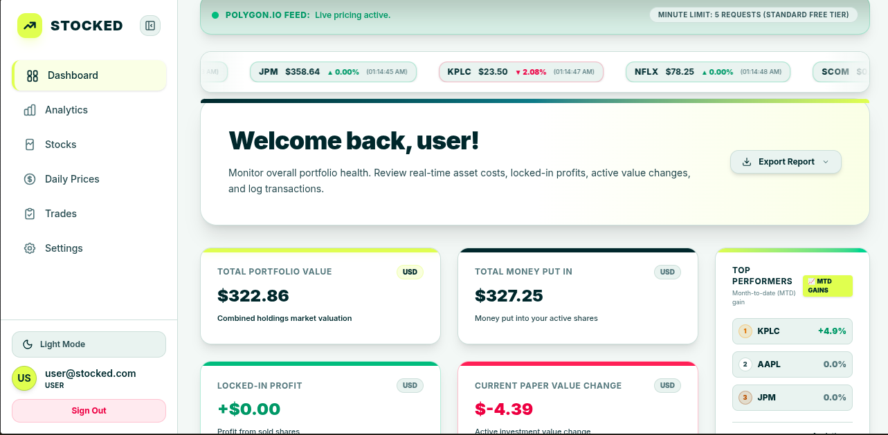 |
| **Ultra-Deep Gun Metal Theme**<br>Constructed on an ultra-deep `#0A1118` canvas accented with luminous Chartreuse highlights (`#CDFF00`) and emerald badges, optimized for high-contrast, low-strain night trading. | **Soft Mint Canvas Theme**<br>Engineered on a fresh, clean mint canvas with crisp Gun Metal headings and emerald indicators, crafted for high-illumination workstation environments. |

#### Design System Highlights
- **Instantaneous Theme Switching**: Live theme toggling directly from the navigation sidebar or the System Settings module.
- **System Synchronization**: Automatically respects your operating system's dark/light schedule via `prefers-color-scheme`.
- **Theme Persistence**: Zero flash of unstyled theme (FOUT) using hydration-safe storage synchronization.

---

## 🏛️ Core System Architecture

### High-Level Component Architecture

Stocked is structured into cleanly decoupled architectural layers designed for scalability, security, and maintainability:

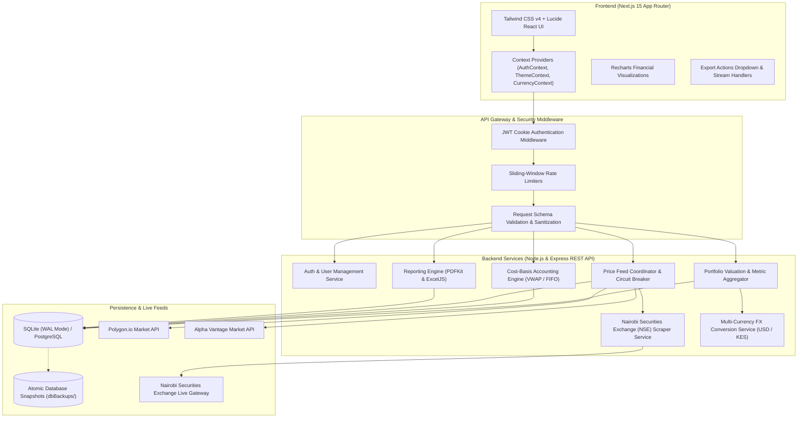

### Real-Time Data Flow & Failover Pipeline

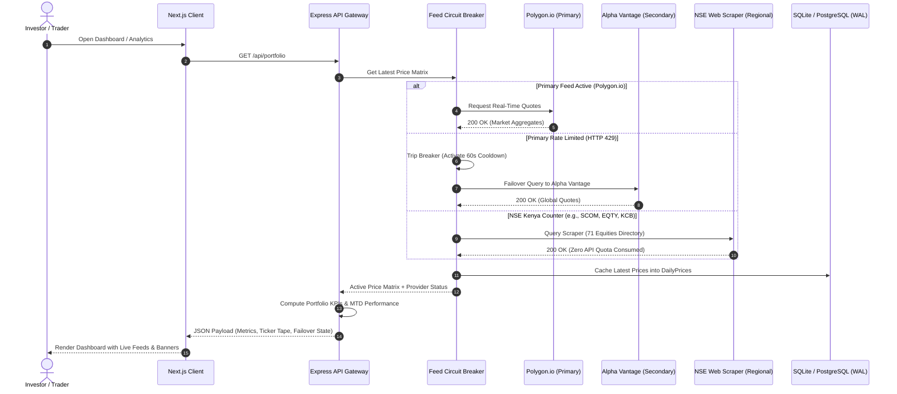

---

## ✨ Comprehensive Feature Presentation Showcase

### 1. Executive Portfolio Dashboard & Live Ticker

The **Dashboard** is the executive command center of Stocked, offering an instant, high-level summary of total net worth, capital invested, locked-in profits, real-time paper gains/losses, top market performers, and streaming ticker data.

| 🌙 Dark Mode Dashboard | ☀️ Light Mode Dashboard |
| :---: | :---: |
|  |  |

#### Feature Breakdown:
- **Live Market Ticker Tape**: Streams ticker cards for all monitored equities (e.g., `AAPL $358.64 ▲ 0.00%`, `KPLC $23.50 ▼ 2.08%`, `NFLX $78.25`, `SCOM $0.29 ▲ 0.66%`) with continuous real-time market sync timestamps.
- **Provider Status Banner**: Highlights the active market data feed (e.g., `● POLYGON.IO FEED: Live pricing active`) alongside tier quotas (`MINUTE LIMIT: 5 REQUESTS (STANDARD FREE TIER)`).
- **Core Financial KPI Cards**:
  - **Total Portfolio Value**: Total aggregated market value of all active holdings converted to the user's selected base currency (`$322.86 USD`).
  - **Total Money Put In**: Net capital invested into currently held shares (`$327.25 USD`).
  - **Locked-In Profit**: Realized profit and loss crystallized upon executed stock sales (`+$0.00 USD`).
  - **Current Paper Value Change**: Live unrealized mark-to-market performance across all open holdings (`-$4.39 USD`).
- **Month-to-Date (MTD) Top Performers**: Dynamically ranks the highest-yielding counters in the user's portfolio (e.g., `1. KPLC +4.9%`, `2. AAPL 0.0%`, `3. JPM 0.0%`).
- **Quick-Action Report Export**: Instant trigger to download structured PDF executive summaries or Excel ledger grids directly from the dashboard header.

#### Dashboard Operations, Recent Activity & Quick Navigation

<p align="center">
  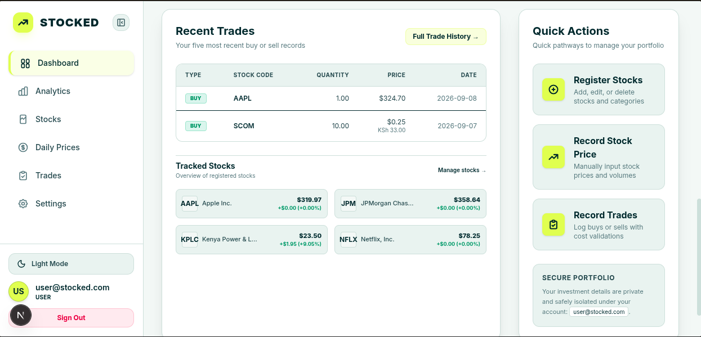
</p>

- **Recent Trades Ledger**: Summarizes the 5 most recent executed transactions with stock symbol, order type (`BUY` / `SELL`), share quantity, executed price (with dual-currency display e.g., `$0.25` / `KSh 33.00`), transaction date, and a fast-path link to the full trade ledger (`Full Trade History →`).
- **Tracked Stocks Grid**: Provides real-time status cards for registered equities showing current market price, daily price change, and percentage shift (e.g., `KPLC +9.05%`), with direct navigation to the asset management catalog (`Manage stocks →`).
- **Quick Action Pathways**: High-visibility shortcuts providing single-click routing to primary management workflows:
  - **Register Stocks**: Add, modify, or categorize securities.
  - **Record Stock Price**: Manually log historical or offline daily price and volume records.
  - **Record Trades**: Launch order forms to buy or sell securities with automated cost validation.
- **Secure Portfolio Isolation Badge**: Visual indicator verifying that user investment portfolios are strictly isolated under the authenticated account session (`user@stocked.com`).

---

### 2. Advanced Performance Analytics & Intelligent Provider Failover

The **Analytics** module provides mathematical rigor for portfolio evaluation, featuring multi-period return analysis, risk volatility metrics, scope filtering, and a resilient price-feed failover circuit breaker.

<p align="center">
  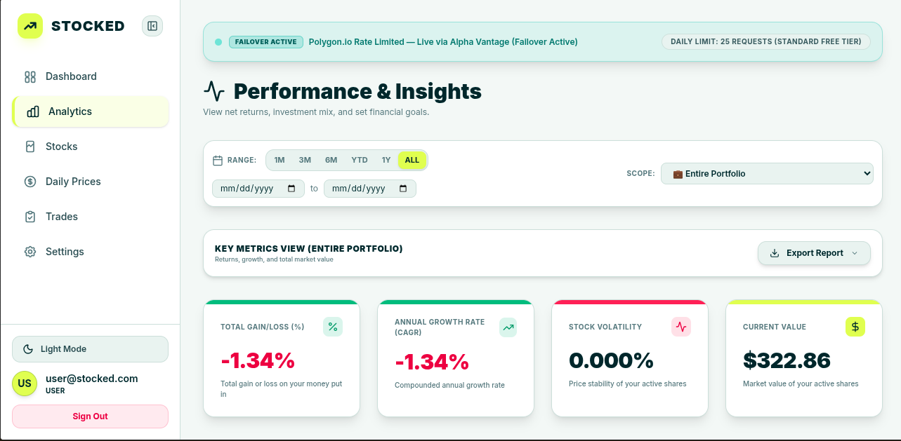
</p>

#### Feature Breakdown:
- **Automated Circuit Breaker & Failover Active Banner**:
  - When a third-party price provider exceeds rate limits (`HTTP 429 Too Many Requests`), the backend triggers a cooldown and transparently switches to the backup provider:
    > `● FAILOVER ACTIVE: Polygon.io Rate Limited — Live via Alpha Vantage (Failover Active) | DAILY LIMIT: 25 REQUESTS (STANDARD FREE TIER)`
  - Prevents stale UI states, broken charts, or application crashes during provider outages.
- **Multi-Period Range Filtering**:
  - Predefined intervals: `1M` (1 Month), `3M` (3 Months), `6M` (6 Months), `YTD` (Year-to-Date), `1Y` (1 Year), and `ALL` (Entire History).
  - Custom date interval picker (`mm/dd/yyyy` to `mm/dd/yyyy`) for granular tax-year or reporting period analysis.
- **Portfolio vs. Asset Scope Selection**:
  - Aggregate analytics across the `Entire Portfolio` or isolate metrics for any registered stock counter.
- **Executive Metric Cards**:
  - **Total Gain/Loss (%)**: Percentage return calculated against total invested capital (`-1.34%`).
  - **Annual Growth Rate (CAGR)**: Compounded annual growth rate annualized over the active holding timeframe (`-1.34%`).
  - **Stock Volatility**: Annualized volatility ($\sigma$) derived from historical daily price variances to quantify market risk (`0.000%`).
  - **Current Value**: Real-time monetary valuation of the selected scope (`$322.86`).

#### Interactive Portfolio Performance Visualizations

<p align="center">
  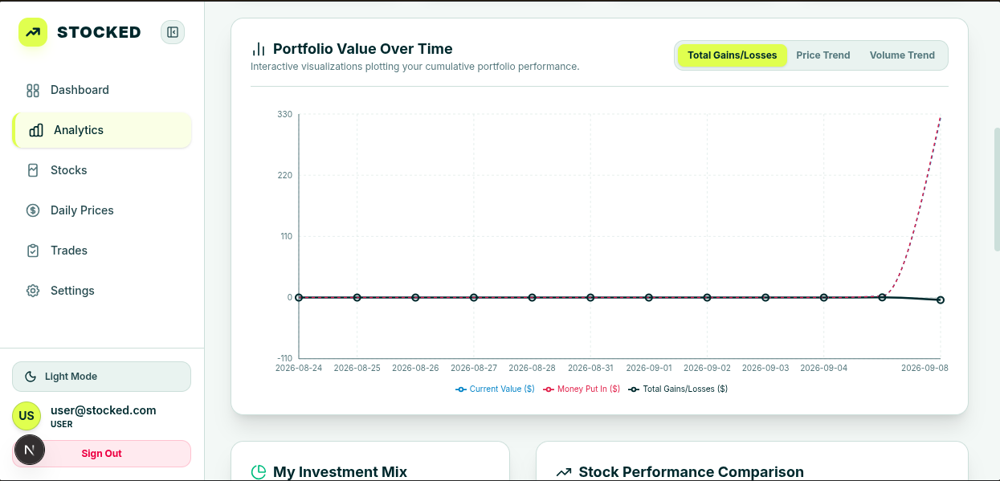
</p>

- **Portfolio Value Over Time**: Dynamic, interactive multi-metric financial chart powered by Recharts, graphing portfolio progression across any chosen interval.
  - **Metric Mode Switcher**: Easily toggle between **Total Gains/Losses**, **Price Trend**, and **Volume Trend**.
  - **Multi-Series Comparative Tracking**: Concurrently visualizes **Current Value ($)** (blue line), **Money Put In ($)** (red dashed baseline), and cumulative **Total Gains/Losses ($)** (dark line) with date ticks and hovering tooltip telemetry.

#### Asset Diversification Mix & Performance Benchmarking

<p align="center">
  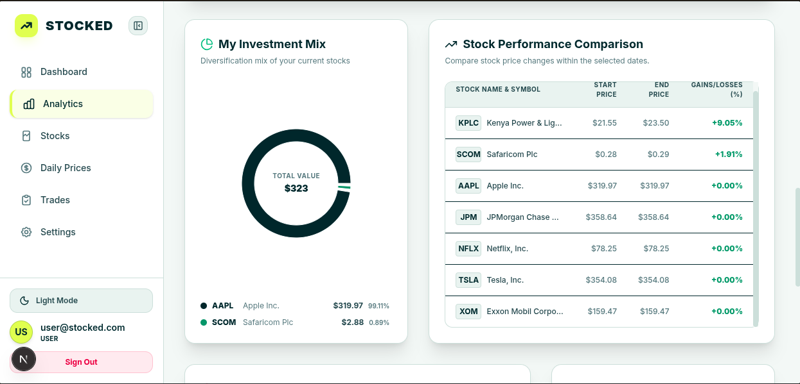
</p>

- **My Investment Mix (Donut Chart)**:
  - Visualizes portfolio diversification and concentration across held counters (e.g., `AAPL 99.11%`, `SCOM 0.89%`).
  - Displays total aggregated portfolio market valuation in the center of the ring (`$323`) along with dollar valuations per position.
- **Stock Performance Comparison Ledger**:
  - Tabular ranking comparing individual price movements within the selected date window.
  - Columns highlight `Stock Name & Symbol`, `Start Price`, `End Price`, and percentage `Gains/Losses (%)` (e.g., `KPLC +9.05%`, `SCOM +1.91%`), enabling swift identification of alpha drivers.

#### Financial Milestones & Milestone Target Engine

<p align="center">
  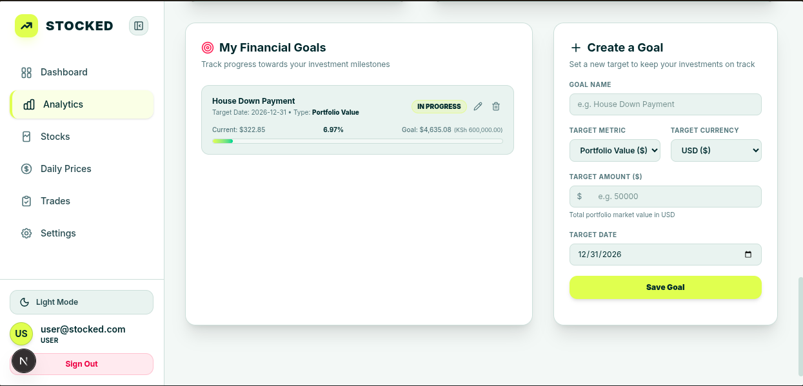
</p>

- **My Financial Goals**:
  - Tracks real-time progress toward personal investment targets (e.g., "House Down Payment" target `$4,635.08` / `KSh 600,000.00` by `2026-12-31`).
  - Visual progress bar indicates completion percentage (`6.97%`), status flags (`IN PROGRESS`), target metrics (`Portfolio Value`), and quick action buttons for editing or removing goals.
- **Create a Goal Desk**:
  - Interactive configuration panel to register new target milestones.
  - Supports configurable `Goal Name`, `Target Metric` (e.g., Portfolio Value), `Target Currency` (`USD` or `KES`), `Target Amount`, and `Target Date`.

---

### 3. Registered Stocks Catalog & Sector Filtering

The **Stocks** module is an asset catalog manager for registering securities, filtering by industry sector, monitoring daily price ranges, and tracking real-time feed connectivity.

<p align="center">
  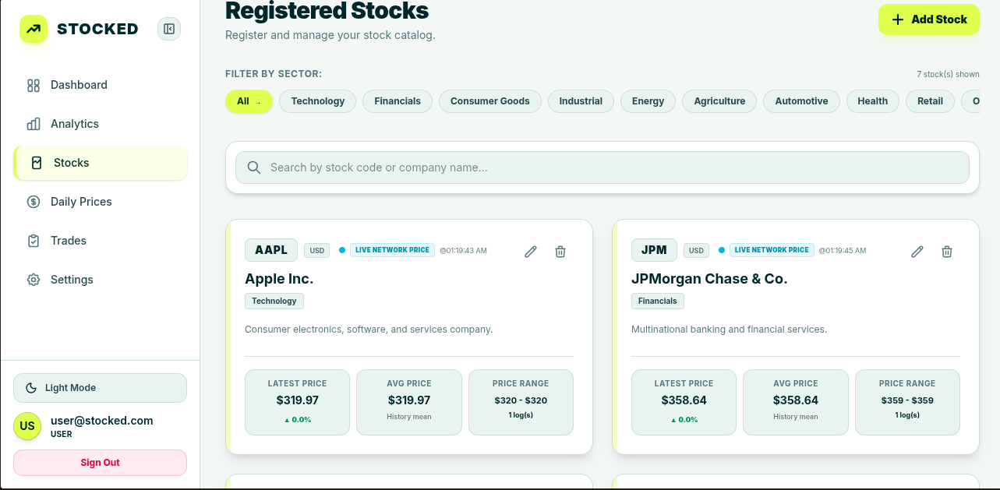
</p>

#### Feature Breakdown:
- **Industry Sector Classification**:
  - Categorize counters into 10+ standard sectors: `All`, `Technology`, `Financials`, `Consumer Goods`, `Industrial`, `Energy`, `Agriculture`, `Automotive`, `Health`, `Retail`, and `Other`.
  - Filter counter cards instantly with interactive pill selectors.
- **Instant Search-as-You-Type**:
  - Rapid search box matching against stock ticker codes (e.g., `AAPL`, `JPM`, `SCOM`) or full corporate names (e.g., `Apple Inc.`, `JPMorgan Chase & Co.`).
- **Asset Overview Cards**:
  - **Ticker & Currency Tag**: Symbol and local currency badge (e.g., `AAPL [USD]`, `SCOM [KES]`).
  - **Live Network Status Indicator**: Real-time badge with last-successful sync timestamp (e.g., `● LIVE NETWORK PRICE @ 01:19:43 AM`).
  - **Company Description & Sector Tag**: Displays sector badge and company profile summary.
  - **Latest Price & Trend**: Current price with color-coded directional movement (`▲ 0.0%`).
  - **Average Price**: Historical arithmetic mean price across all recorded logs (`$319.97`).
  - **Price Range & Log Counter**: Visualizes recorded price boundaries (`$320 - $320`) and total historical logs (`1 log(s)`).
  - **Counter Administration**: In-place edit modal trigger and safe cascade deletion.

---

### 4. Daily Price Recording & Historical Market Data Ledger

The **Daily Prices** module provides complete control over market pricing data, allowing automated ingestion from external feeds alongside precise manual entry for historical backfilling or offline auditing.

<p align="center">
  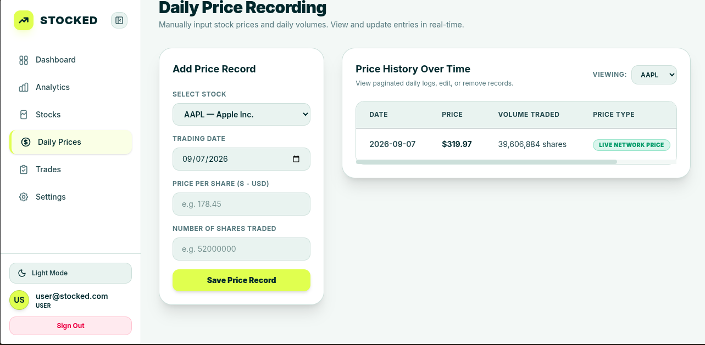
</p>

#### Feature Breakdown:
- **Split Operational Trading Desk**:
  - **Left Form: Add Price Record**:
    - Stock selector dropdown showing ticker and company name (`AAPL — Apple Inc.`).
    - Date picker defaulted to the current trading session (`09/07/2026`).
    - Price per share input with currency localization (`$ - USD`).
    - Number of shares traded (daily market volume).
    - Save action with server-side validation against zero or negative values.
  - **Right Table: Price History Over Time**:
    - Asset-specific filter dropdown (`Viewing: AAPL`).
    - High-density tabular ledger tracking:
      - `Date` (e.g., `2026-09-07`)
      - `Price` (e.g., `$319.97`)
      - `Volume Traded` (e.g., `39,606,884 shares`)
      - `Price Type` provenance badge (`LIVE NETWORK PRICE` vs. `MANUAL ENTRY`)
    - Pagination controls and scrollable table layout for large datasets.

---

### 5. Trade Execution & Multi-Currency Transaction Ledger

The **Trades** module is an execution and ledger terminal supporting buy/sell order placement, multi-currency trade tracking, short-selling prevention, and historical trade auditing.

<p align="center">
  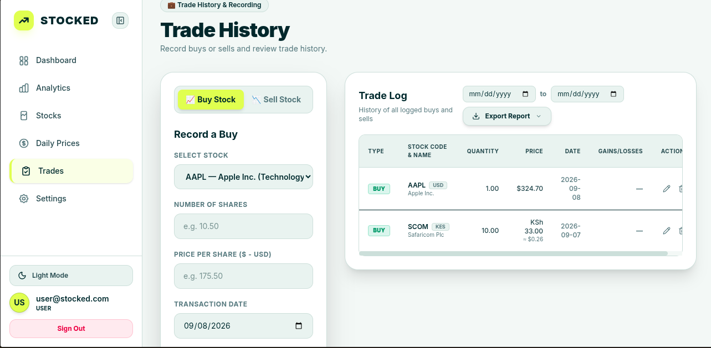
</p>

#### Feature Breakdown:
- **Dual-Mode Order Execution**:
  - Toggle between `📈 Buy Stock` and `📉 Sell Stock` workflows with instant form state transitions.
  - Form fields include: Stock Selector (with sector label), Number of Shares, Price Per Share, and Transaction Date.
- **Short-Selling Prevention Engine**:
  - Prior to accepting any sale transaction, the backend verifies current settled holdings. If a user attempts to sell more shares than they currently own ($Q_{\text{sale}} > Q_{\text{available}}$), the order is rejected with an explanatory error.
- **Multi-Currency Transaction Ledger**:
  - Natively tracks trades executed in different international currencies (e.g., `AAPL` in `USD` vs. `SCOM` in `KES`).
  - Automatically computes and displays dual-currency conversion estimates (e.g., `KSh 33.00 ≈ $0.26`).
- **Realized P&L Crystallization**:
  - When recording sales, realized gains/losses are computed according to the active accounting methodology (Average Cost or FIFO) and saved permanently with the sale record.
- **Trade Log Table**:
  - Details: `TYPE` badge (`BUY` / `SELL`), `STOCK CODE & NAME`, `QUANTITY`, `PRICE`, `DATE`, `GAINS/LOSSES`, and row-level `ACTIONS` (Edit / Delete).
  - Includes custom date-range filtering and on-demand report export streaming.

---

### 6. Executive Report Generation (Branded PDF & Formatted Excel)

Stocked features an institutional reporting engine allowing investors to export audit-grade PDF documents and Excel analytical spreadsheets with a single click.

<p align="center">
  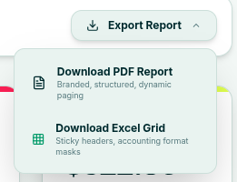
</p>

#### Available Formats:
- **Download PDF Report (`.pdf`)**:
  - Vector-rendered using `PDFKit`.
  - Features corporate Stocked branding, clean typography, dynamic page numbering, confidentiality disclaimers, user attribution, and structured portfolio summaries.
- **Download Excel Grid (`.xlsx`)**:
  - High-density spreadsheet generated with `ExcelJS`.
  - Configured with sticky frozen header rows, auto-sized columns, and strict accounting numeric format masks (`$#,##0.00` / `KSh #,##0.00`).
- **Audit Logging**: Every export request is persistently logged in the `ExportLogs` database entity, tracking timestamps, format type, user ID, and generated filenames.

---

### 7. System Settings & Platform Administration

The **Settings** module provides four specialized tabs for configuring appearance, external market data connections, multi-currency base valuations, and portfolio accounting methodologies.

#### A. Appearance & Dynamic Theme Configuration
<p align="center">
  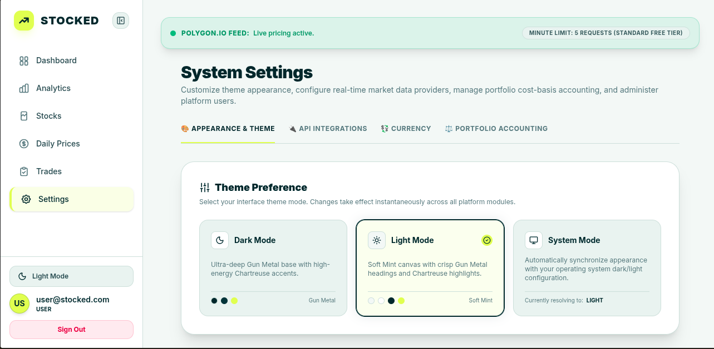
</p>

- **Theme Preference Cards**:
  - **Dark Mode**: Ultra-deep Gun Metal base with high-energy Chartreuse accents.
  - **Light Mode**: Soft Mint canvas with crisp Gun Metal headings and Chartreuse highlights.
  - **System Mode**: Automatically synchronizes appearance with the host operating system's light/dark mode settings.
- **Color Palette Preview Swatches**: Real-time color chips displaying background, text, and accent tones for each mode.

---

#### B. Multi-Tier Live Market Price Feeds & Nairobi Securities Exchange (NSE) Scraper
<p align="center">
  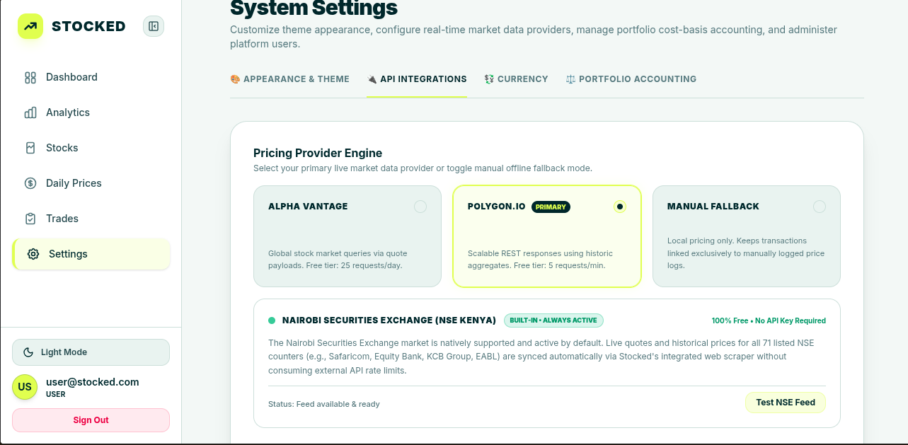
</p>

- **Pricing Provider Engine**:
  - **Alpha Vantage**: Global stock market queries via quote payloads (25 requests/day on standard free tier).
  - **Polygon.io (Primary)**: High-frequency REST aggregates (5 requests/min on standard free tier).
  - **Manual Fallback**: Offline mode restricting transactions and valuations exclusively to manually entered price logs.
- **Nairobi Securities Exchange (NSE Kenya) Integrated Engine**:
  - **100% Free & No API Key Required**: Built-in scraper fetching quotes and historical price data for all 71 listed equities on the NSE (e.g., Safaricom, Equity Bank, KCB Group, EABL).
  - Operates autonomously without consuming external API rate limits.
  - Includes an interactive **Test NSE Feed** diagnostic button to verify connectivity in real-time.

---

#### C. Multi-Currency Management & Real-Time FX Conversion Engine
<p align="center">
  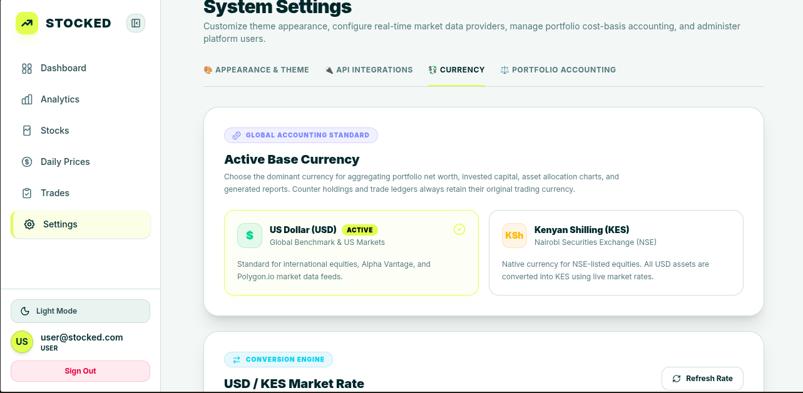
</p>

- **Active Base Currency Selection**:
  - **US Dollar (USD)**: Global benchmark standard for US markets, Alpha Vantage, and Polygon.io feeds.
  - **Kenyan Shilling (KES)**: Native domestic currency for Nairobi Securities Exchange equities.
- **Dynamic Conversion Engine**:
  - Aggregates multi-currency positions into a single unified base currency for portfolio net worth and export documents.
  - Live **USD / KES Market Rate** synchronization with an on-demand **Refresh Rate** trigger.
  - Custom exchange rate overrides with server-side validation bounds (`50.0 <= rate <= 300.0`).

---

#### D. Cost-Basis Accounting Methodology & Automated Historical Recalculation
<p align="center">
  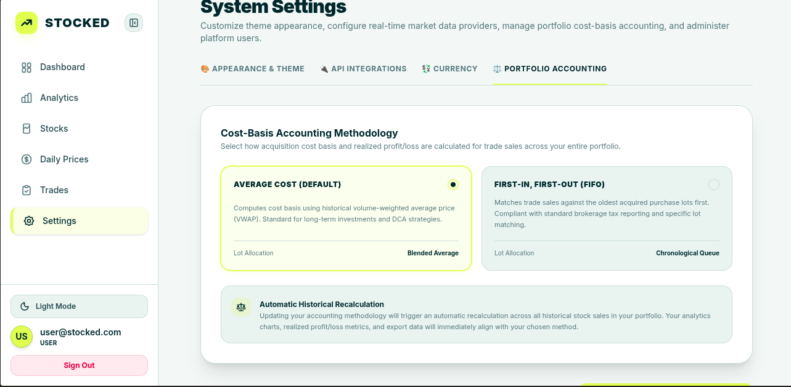
</p>

- **Accounting Methodology Options**:
  - **Average Cost (Default)**:
    - Calculates cost basis using historical volume-weighted average price (VWAP).
    - Recommended for long-term investments, dollar-cost averaging (DCA), and blended mutual fund styles.
    - Lot Allocation: *Blended Average*.
  - **First-In, First-Out (FIFO)**:
    - Matches trade sales against the oldest acquired purchase lots chronologically.
    - Compliant with standard brokerage tax reporting and specific lot identification rules.
    - Lot Allocation: *Chronological Queue*.
- **Automatic Historical Recalculation Engine**:
  - Switching methodologies automatically triggers an atomic recalculation across all historical stock sales in the user's portfolio. Realized P&L, analytics, and export ledgers are immediately realigned with zero manual data cleanup required.

---

## 🧮 Financial Accounting Engine & Mathematical Formulations

Stocked incorporates strict, deterministic mathematical models to calculate portfolio performance, cost basis, and currency normalization:

### Average Cost Basis (Volume-Weighted Average Price - VWAP)

Under the Average Cost method, the unit cost basis $\bar{C}_t$ is recomputed dynamically whenever a new purchase is recorded:

$$\bar{C}_t = \frac{\sum_{i=1}^{n} (Q_i \times P_i)}{\sum_{i=1}^{n} Q_i}$$

Where:
- $Q_i$ = Number of shares acquired in purchase transaction $i$
- $P_i$ = Unit purchase price of transaction $i$

When a sale transaction occurs, the unit cost basis $\bar{C}_t$ remains unchanged, while total remaining invested capital scales down by $(Q_{\text{sold}} \times \bar{C}_t)$.

---

### First-In, First-Out (FIFO) Lot Allocation

Under FIFO, purchases form a chronological queue of unexhausted lots:

$$\mathcal{L} = \left[ (q_1, p_1), (q_2, p_2), \dots, (q_m, p_m) \right]$$

When a sale of quantity $Q_{\text{sale}}$ is executed, shares are drawn from the earliest active lots:

$$\text{Cost Basis of Sale} = \sum_{k=1}^{j} (q_{\text{drawn}, k} \times p_k) \quad \text{such that} \quad \sum_{k=1}^{j} q_{\text{drawn}, k} = Q_{\text{sale}}$$

Remaining unallocated shares in lot $j$ stay in the queue for future sales.

---

### Realized & Unrealized Profit & Loss

1. **Realized Profit & Loss ($P\&L_{\text{realized}}$)** is locked in at the moment of sale:
   $$P\&L_{\text{realized}} = (\text{Selling Price} - \text{Unit Cost Basis at Execution Time}) \times Q_{\text{sale}}$$

2. **Unrealized (Paper) Profit & Loss ($P\&L_{\text{unrealized}}$)** dynamically tracks current market value:
   $$P\&L_{\text{unrealized}} = (P_{\text{current}} - \text{Unit Cost Basis}) \times Q_{\text{held}}$$

3. **Aggregate Portfolio Net Worth**:
   $$\text{Portfolio Valuation} = \sum_{s \in \text{Assets}} \left( Q_{\text{held}, s} \times P_{\text{current}, s} \times \text{FX}_{s \to \text{base}} \right)$$

---

### Compound Annual Growth Rate (CAGR) & Annualized Volatility

1. **Compound Annual Growth Rate (CAGR)**:
   $$\text{CAGR} = \left( \frac{V_{\text{end}}}{V_{\text{start}}} \right)^{\frac{1}{T}} - 1$$
   *Where $T$ represents the holding duration expressed in decimal years ($T = \frac{\Delta \text{Days}}{365.25}$).*

2. **Annualized Sample Volatility ($\sigma_{\text{ann}}$)**:
   $$\sigma_{\text{ann}} = \sqrt{252} \times \sqrt{\frac{1}{N-1} \sum_{t=1}^{N} \left( R_t - \bar{R} \right)^2}$$
   *Where $R_t = \ln\left(\frac{P_t}{P_{t-1}}\right)$ represents continuous daily logarithmic returns.*

---

### Multi-Currency FX Valuation Normalization

When equities are denominated in different local currencies (e.g., KES on the NSE and USD on US exchanges), all portfolio valuations are converted into the user's active base currency:

$$
V_{\text{normalized}} = \begin{cases} 
V_{\text{asset}} & \text{if } \text{Currency}_{\text{asset}} = \text{Currency}_{\text{base}} \\
V_{\text{asset}} \times R_{\text{USD} \to \text{KES}} & \text{if } \text{Currency}_{\text{asset}} = \text{USD} \land \text{Currency}_{\text{base}} = \text{KES} \\
\frac{V_{\text{asset}}}{R_{\text{USD} \to \text{KES}}} & \text{if } \text{Currency}_{\text{asset}} = \text{KES} \land \text{Currency}_{\text{base}} = \text{USD}
\end{cases}
$$

---

## 🔒 Security, Multi-Tenancy & Database Safety Standards

### Multi-Tenant User Data Isolation
Every API endpoint, SQL query, and data mutation strictly enforces tenancy filtering using the authenticated user's ID (`userId`). Users are completely isolated; cross-account reads or writes are strictly prohibited.

### Authenticated API Key Encryption (AES-256-GCM)
Third-party market data API keys are encrypted at rest using **AES-256-GCM**. Encryption keys are derived using PBKDF2 with user-specific salts, guaranteeing that stored secrets cannot be decrypted without the host encryption secret.

### Mandatory Database Backup Policy (Per AGENTS.md)

> [!CAUTION]
> **CRITICAL POLICY**: A verified backup of the database must be executed in the `dbBackups/` directory before any and all destructive database operations (migrations, rollbacks, column drops, truncations, or seed updates).

#### Executing a Database Backup:
```bash
# From the project root:
node scripts/backup_db.js

# Or from the backend directory:
npm run db:backup
```

Each backup automatically:
1. Checkpoints the SQLite WAL journal: `PRAGMA wal_checkpoint(TRUNCATE);`
2. Generates an atomic snapshot via `VACUUM INTO` (`dbBackups/database_backup_<timestamp>.sqlite`).
3. Dumps a complete structured JSON export (`dbBackups/database_dump_<timestamp>.json`).
4. Updates `dbBackups/database_latest.sqlite`, `dbBackups/database_latest.json`, and records the run in `dbBackups/backup_manifest.json`.

---

## 🔌 Complete REST API Endpoint Reference

| Method | Endpoint | Description | Auth Required |
| :--- | :--- | :--- | :---: |
| `POST` | `/api/auth/register` | Register a new user account | No |
| `POST` | `/api/auth/login` | Authenticate user & issue secure JWT cookie | No |
| `POST` | `/api/auth/logout` | Invalidate and clear session cookie | Yes |
| `GET` | `/api/auth/me` | Fetch active user identity and role | Yes |
| `GET` | `/api/stocks` | Retrieve user's registered stock catalog | Yes |
| `POST` | `/api/stocks` | Create and register a new stock counter | Yes |
| `PUT` | `/api/stocks/:id` | Update stock counter metadata | Yes |
| `DELETE`| `/api/stocks/:id` | Cascade-delete stock counter and records | Yes |
| `GET` | `/api/prices` | Query historical daily price and volume records | Yes |
| `POST` | `/api/prices` | Manually log or update daily stock price | Yes |
| `POST` | `/api/prices/sync` | Trigger on-demand sync from active price feed | Yes |
| `GET` | `/api/transactions`| List purchase and sales transaction ledger | Yes |
| `POST` | `/api/transactions`| Record purchase or sale (with short-sell prevention) | Yes |
| `GET` | `/api/portfolio` | Query portfolio KPIs, valuation, and MTD leaders | Yes |
| `GET` | `/api/analytics` | Fetch performance time series, CAGR, & volatility | Yes |
| `POST` | `/api/exports/generate`| Generate and stream branded PDF or Excel report | Yes |
| `GET` | `/api/settings` | Retrieve user settings (theme, feed, currency, method) | Yes |
| `PUT` | `/api/settings` | Update settings & trigger historical recalculation | Yes |
| `POST` | `/api/settings/test-nse`| Test connectivity to the NSE Kenya web scraper | Yes |
| `GET` | `/api/admin/users` | List platform accounts (admin role only) | Yes (Admin) |

---

## 🚀 Installation, Configuration & Getting Started

### Prerequisites
- [Node.js (v18.0.0+)](https://nodejs.org/)
- `npm` (v9.0.0+)
- SQLite3 or PostgreSQL database

---

### 1. Backend Installation & Configuration

```bash
# Navigate to the backend directory
cd backend

# Install dependencies
npm install

# Create environment file
cp .env.example .env
```

#### Backend Environment Variables (`backend/.env`):
| Variable | Description | Default / Example |
| :--- | :--- | :--- |
| `PORT` | Server listening port | `5001` |
| `JWT_SECRET` | Secret key for signing session tokens | `your-secure-jwt-secret-key` |
| `ENCRYPTION_SECRET` | 32-character hex key for AES-256-GCM encryption | `0123456789abcdef0123456789abcdef...` |
| `DATABASE_URL` | PostgreSQL connection URL (leave blank for local SQLite) | `""` |
| `PRICE_FEED_PROVIDER`| Default live price provider (`polygon`, `alphavantage`, `nse`, `manual`) | `polygon` |

```bash
# Run database migrations
npm run migrate

# Launch backend in development mode
npm run dev
```
> REST API is now operational at `http://localhost:5001`.

---

### 2. Frontend Installation & Configuration

```bash
# Navigate to the frontend directory
cd ../frontend

# Install dependencies
npm install

# Create local environment configuration
cp .env.local.example .env.local
```

#### Frontend Environment Variables (`frontend/.env.local`):
| Variable | Description | Value |
| :--- | :--- | :--- |
| `NEXT_PUBLIC_API_BASE_URL` | Backend REST API base URL | `http://localhost:5001` |

```bash
# Launch Next.js in development mode
npm run dev
```
> Open your browser and navigate to `http://localhost:3000`.

---

### 3. Executing Test Suites & Verification

Always execute verification suites after modifying backend services or frontend pages:

```bash
# Run backend test suite
cd backend
npm test

# Verify TypeScript compilation on both tiers
npm run build
cd ../frontend
npm run build
```

---

### 4. Executing Database Backups

```bash
# Run standalone atomic database backup from root:
node scripts/backup_db.js
```

Snapshots are written directly to `dbBackups/` with automated manifest logging.

---

## 📄 Classification & License

This software is classified as **Internal / Educational**. Developed for investment portfolio management simulation and capital market education. Not intended for regulated financial advice.

Distributed under the **MIT License**.
